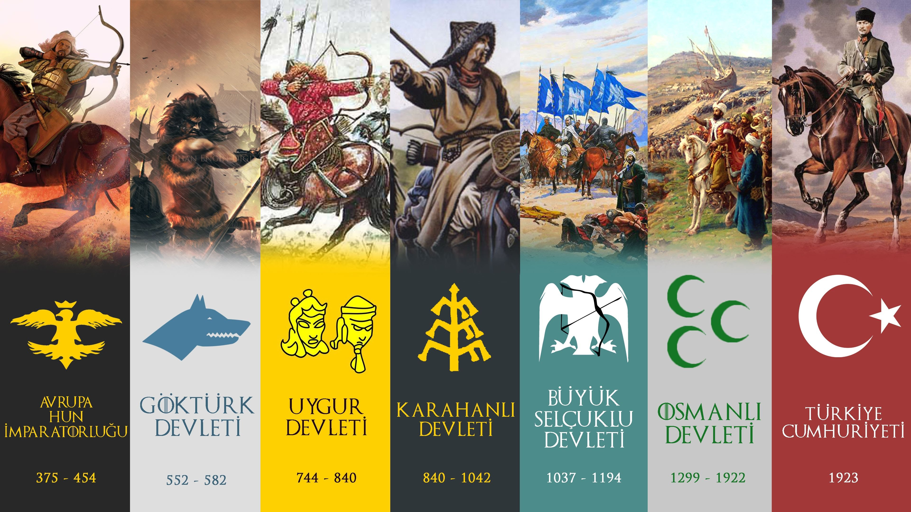

Bu sayfamız da Atalarımızın bizler için söylediği anlamlı sözler ve zor şartlar da yaptığı tüm icraatlar paylaşılmaya çalışılacaktır. O zaman şartlarında Bilişim, Hacking, Siber Güvenlik kavramları olmadığından dolayı. Atasözlerindeki ilim veya fen gibi kelimeleri günümüze göre uyarlayın.

- **Mustafa Kemal Atatürk** - İtiraf ederim ki, düşmanlarımız çok çalışıyor. Biz de onlardan daha çok çalışmaya mecburuz. Çalışmak demek, boşuna yorulmak, terlemek değildir. Zamanın gereklerine göre bilim ve teknik ve her türlü medeni buluşlardan azami derecede yararlanmak zorunludur.

- **Sultan İkinci Abdülhamid** - Ben her Caminin yanında bir mektep görmek isterim. Şunu iyi bilin ben okumuş adamdan korkmam. İki şey çok önemlidir. Din ve FEN!

- **Fatih Sultan Mehmed** - Bir çok tarihçi'ye göre ilk havan topunu icat ettiği düşünülüyor. 

Atalarımızın çalışkanlık, ilim ve/veya fen ile ilgili sözlerini ve icraatlarını paylaşmaya çalışacağız. 
Tarihçi değiliz, Atasözlerinde ve İcraatlar da eksiklik veya yanlışlık var ise düzeltmemiz için bize ulaşın. :)

